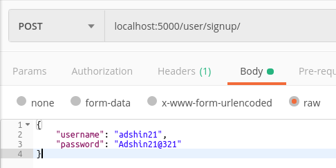
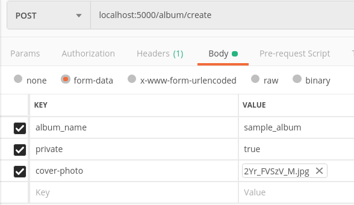
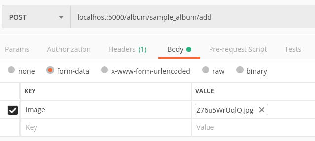
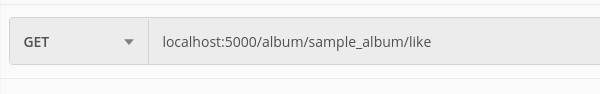

#  A Photo Gallary App

* ## [User](https://github.com/adshin21/cc/blob/master/api/routes/User.js)
The user will have following propreties
* Username is unique
* For login required a password
* The user can be deleted hence all the documents related to this user will be deleted excepts the shared one

### Routes

All the routes regading to user will be _localhost:5000/user/somemethod_

### [signup](https://github.com/adshin21/cc/blob/master/api/routes/User.js#L12)

**Method: Post**

**URL:** _localhost/user/signup_

**Data:** A json as with username and password

**Response Status:** 200

**Auth Required:** No

**Note:** _The should contain_
* At least one upper case English letter,

* At least one lower case English letter,

* At least one digit,

* At least one special character,

* Minimum eight in length

### [login](https://github.com/adshin21/cc/blob/master/api/routes/User.js#L74)

**Method: Post**

**URL:** _localhost:5000/user/login_

**Data:** A json as with username and password

**Response Status:** 200 with a "token"

**Respose:** It returns a [jwt token](https://en.wikipedia.org/wiki/JSON_Web_Token) that will be used to get the information regarding user is authenticated or not.
This token will be set to every request headers to authunticate the requests.

**Auth Required:** No

### [delete](https://github.com/adshin21/cc/blob/master/api/routes/User.js#L113)

**Method: Delete**

**URL:** _localhost:5000/user/username_

**Response Status:** 200 if the delete is successfull

**Auth Required:** Yes

---

* ## [Album](https://github.com/adshin21/cc/blob/master/api/routes/Album.js)
The Album will have following properties
* Album name is unique
* Album can be public and private
* Album can be liked and share ( only by it's owner )
* Images will be inside the album

**Routes**

### [album_name](https://github.com/adshin21/cc/blob/master/api/routes/User.js#L74)

**Method: Get**

**URL:** *localhost:5000/album/:album_name*

**Response Status:** 200

**Respose:** It will list the album details and images containing inside it.

**Auth Required:** If the album is private

### [create](https://github.com/adshin21/cc/blob/master/api/routes/Album.js#L49)

**Method: Post**

**URL:** *localhost:5000/album/create*

**Data:** A file data with cover_photo, album_name and private info.

**Response Status:** 200

**Respose:** It will create an album with desiresed attributes.

**Auth Required:** Yes

### [add](https://github.com/adshin21/cc/blob/master/api/routes/Album.js#L125)

**Method: Post**

**URL:** *localhost:5000/album/:album_name/add*

**Data:** A file (image) that will be added to that album.

**Response Status:** 200

**Respose:** It will add the image to that particular album.

**Auth Required:** Yes

### [like](https://github.com/adshin21/cc/blob/master/api/routes/Album.js#L173)

**Method: Get**

**URL:** *localhost:5000/album/:album_name/like*

**Data:** Not Required.

**Response Status:** 200

**Respose:** It will like that album if not liked before otherwise unlikes it.

**Auth Required:** Yes

### [delete/album](https://github.com/adshin21/cc/blob/master/api/routes/Album.js#L270)

**Method: Delete**

**URL:** *localhost:5000/album/:album_id*

**Data:** Not Required.

**Response Status:** 200

**Respose:** It will remove the album and it's images permanently.

**Auth Required:** Yes

### [delete/image](https://github.com/adshin21/cc/blob/master/api/routes/Album.js#L223)

**Method: Delete**

**URL:** *localhost:5000/album/:album_name/:image_id*

**Data:** Not Required.

**Response Status:** 200

**Respose:** It will remove the particular album images permanently.

**Auth Required:** Yes

